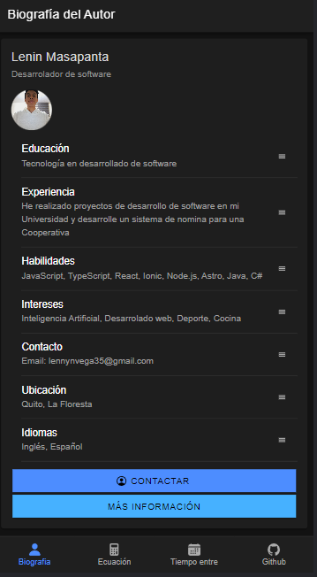
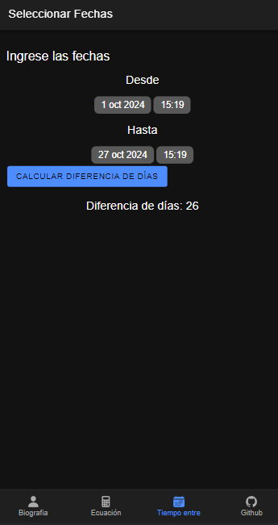
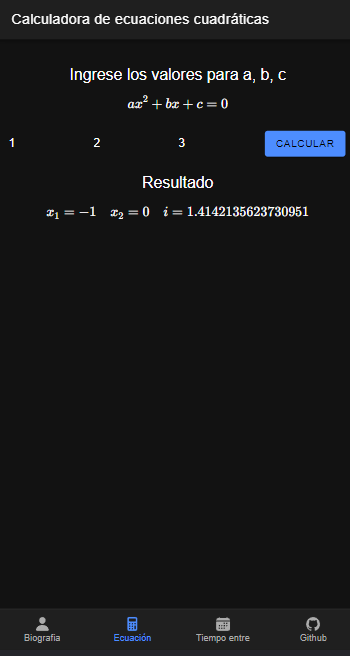

# 📱 Aplicación Móvil en Ionic

Bienvenido a la aplicación móvil creada en Ionic. Esta aplicación ofrece diversas funcionalidades agrupadas en cuatro pestañas principales, donde puedes conocer al autor, realizar cálculos y almacenar información localmente.

## 🚀 Características de la Aplicación

### 1. Biografía del Autor

- Esta pestaña ofrece una **descripción detallada del autor**.
- Contiene **15 componentes visuales** para mostrar información sobre el autor.

   

### 2. Foto y Enlace a GitHub

- Muestra la **foto del autor**.
- Incluye un **enlace directo al repositorio de GitHub** de esta aplicación para obtener el código fuente.

   

### 3. Cálculo de Días entre Fechas

- Permite seleccionar dos fechas usando **Datepickers**.
- Calcula y muestra la cantidad de días entre ambas fechas.

   

### 4. Cálculo de Ecuaciones Cuadráticas

- Permite al usuario ingresar los coeficientes de una **ecuación cuadrática**.
- Calcula y muestra las raíces de la ecuación.

   

## 📂 Instalación

1. Clona este repositorio en tu máquina local:

   ```bash
   git clone https://github.com/lennynT219/Aplicacion-ionic-P1.git
   ```

2. Instala las dependencias del proyecto:

   ```bash
   npm install
   ```

3. Ejecuta la aplicación en tu navegador:

   ```bash
    ionic serve
   ```

